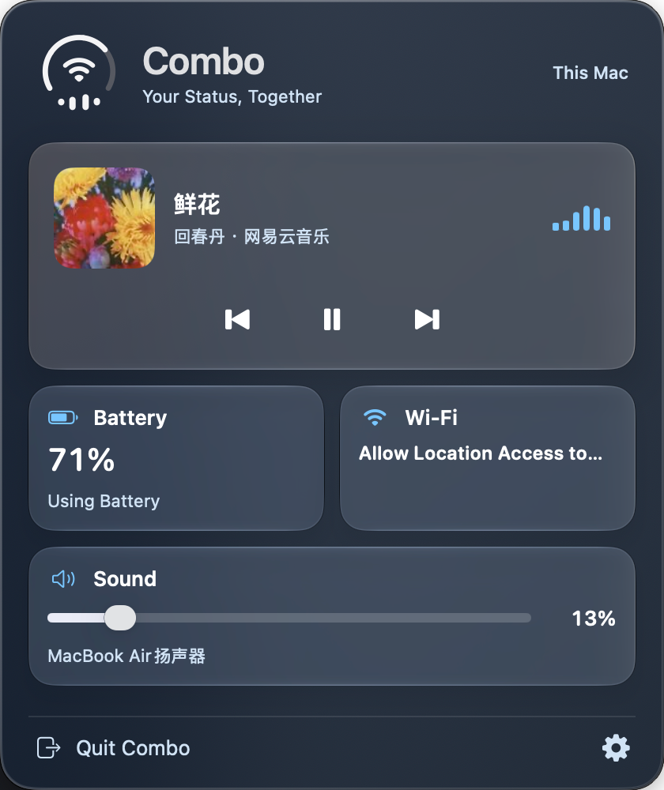

<p align="center">
  
</p>

<h1 align="center">Combo</h1>

<p align="center"><strong>Battery, Wi-Fi, and sound. One menu bar icon.</strong></p>

<p align="center">
  <a href="https://github.com/fanglinwei/Combo"></a>
  <a href="https://github.com/fanglinwei/Combo/releases"></a>
  <a href="https://github.com/fanglinwei/Combo/releases"></a>
  <a href="LICENSE"></a>
  <a href="#requirements-and-installation"></a>
  <a href="#build-from-source"></a>
</p>

<p align="center">
  English · <a href="README.zh-CN.md">简体中文</a>
</p>

<p align="center">
  <a href="https://github.com/fanglinwei/Combo/releases">Releases</a> ·
  <a href="#getting-started">Getting started</a> ·
  <a href="#build-from-source">Build from source</a> ·
  <a href="https://github.com/fanglinwei/Combo/issues">Report an issue</a>
</p>

Combo is a macOS menu bar app for checking battery status, joining Wi-Fi networks, adjusting volume, and controlling media playback.

Combo is designed primarily for people who work on a MacBook and love listening to music, bringing work and music together in the menu bar.

## Interface preview

### Combo in the macOS menu bar

<p align="center">
  
</p>

[Static preview](docs/assets/combo-menu-bar-preview.png)

### Combo panel

<p align="center">
  
</p>

The Combo panel brings macOS Wi-Fi, battery, and sound controls together, so you can join networks, check battery levels, adjust supported battery options, change volume, and switch audio outputs in one place.

### Menu bar icon in motion

| Connecting to Wi-Fi | Charging while playing | Listening with AirPods | Adjusting AirPods volume |
| :---: | :---: | :---: | :---: |
|  |  |  |  |

These GIFs use the app's own icon renderer and demo data. See the [icon gallery](docs/product/icon-gallery.md) for more examples (in Chinese).

## Features

- **Status icon**: Battery around the edge, network or audio device in the center, and volume or playback below. Low battery turns red; charging turns green.
- **Battery**: Check charge, charging status, health, and any readable charging limit, or switch supported energy modes. While plugged in with charging paused by a manual limit, **Charge to Full Now** can temporarily lift that limit; macOS manages its restoration.
- **Wi-Fi**: Toggle Wi-Fi, browse and join networks, use saved passwords, or choose to remember a password locally. Personal Hotspot and enterprise authentication continue in macOS Wi-Fi settings.
- **Sound and AirPods**: Switch outputs, adjust volume, and mute. On supported devices, check AirPods battery levels and change noise control modes. Find nearby AirPlay devices and connect through macOS Sound settings.
- **Media controls**: View the track, artwork, and source app; use previous, play/pause, and next, or open the source app. The player must provide media information and the relevant controls to macOS.
- **Personalization**: Three theme colors, light and dark appearances, English and Simplified Chinese, and launch at login. Playback bars follow a fixed loop; animations can be disabled and respect Reduce Motion. Settings offers 16 icon previews; a menu bar demo starts only when you choose it and ends when you close settings.

Some features depend on your device and macOS version. See [Compatibility](#compatibility) for support details and [Permissions and privacy](#permissions-and-privacy) for access and password storage.

## Requirements and installation

- **macOS 26.0 or later.** Some integrations have narrower [compatibility](#compatibility).
- **Apple Silicon is the currently verified development environment.** Intel compatibility has not been verified. The build script targets the architecture of the build machine.
- **A MacBook with a readable internal battery** is needed for battery-specific information and charging controls.

### Releases

[Visit GitHub Releases](https://github.com/fanglinwei/Combo/releases) for published packages and release notes.

**The 1.2.0 package is being prepared; no release assets are currently published.** Until a package is available, use the [source build instructions](#build-from-source). Check the release notes for the package's supported architecture and signing status when downloading.

### Manual installation

Once a release package has been published:

1. Download the package for your Mac from [Releases](https://github.com/fanglinwei/Combo/releases). For Apple Silicon, choose a package identified as `arm64` or Apple Silicon. Intel support is currently unverified; use an Intel package only if the release explicitly provides and supports it.
2. Extract the `.zip`, or open the `.dmg`, according to the published package format.
3. Drag **`Combo.app`** into **Applications** (`/Applications`). When replacing an existing installation, quit Combo first.
4. Open **Applications → Combo**. Find its icon in the menu bar and follow the first-launch guide; Combo runs as a menu bar app without a Dock icon.

### First launch: macOS blocks the app

> [!IMPORTANT]
> Current local builds use **ad-hoc signing**, and Developer ID signing and Apple notarization are not configured. Check the release notes for the downloaded version's signing status. The route below applies to a trusted copy of Combo downloaded from this repository's Releases page.

**Follow the steps in order. Stop once Combo opens, then continue with [Getting started](#getting-started).**

#### Step 1: Check the installation and try opening it

1. Make sure `Combo.app` is in Applications, rather than still inside an archive or mounted disk image.
2. Open Applications in Finder and double-click `Combo.app`.
3. Continue according to the result: if the app opens and its menu bar icon appears, installation is complete. If macOS cannot verify the developer or check the app for malicious software, continue to Step 2. If the message says the app is damaged, go directly to Step 4 and download a fresh copy.

#### Step 2: Allow it in System Settings

1. Click Done or OK in the blocking dialog to keep the app.
2. Open System Settings → Privacy & Security, then scroll to the Security section.
3. Find the message about Combo being blocked, click Open Anyway, authenticate if requested, and confirm Open.
4. Open Combo again from Applications. If its menu bar icon appears, you can start using it. If Open Anyway is unavailable or the app remains blocked, continue to Step 3.

The System Settings procedure follows [Apple's app-opening guide](https://support.apple.com/en-us/102445).

#### Step 3: Remove the download quarantine attribute in Terminal

1. Press `Command-Space` to open Spotlight, search for Terminal, and open it.
2. Copy and paste the command below, then press Return:

   ```sh
   xattr -dr com.apple.quarantine "/Applications/Combo.app"
   ```

3. If there is no error, open Combo again from Applications. The command normally produces no output on success; stop troubleshooting if the app opens.
4. If you see `Permission denied` or `Operation not permitted`, retry with administrator authorization:

   ```sh
   sudo xattr -dr com.apple.quarantine "/Applications/Combo.app"
   ```

   Enter your Mac login password and press Return. Terminal does not display the characters as you type.
5. If you see `No such file`, check that the app is in `/Applications`. If you installed it elsewhere, change the command to use its actual path. If it still will not open, continue to Step 4.

This step removes the download quarantine attribute from `Combo.app`. A new download or replacement may carry that attribute again.

#### Step 4: The app still will not open, or is reported as damaged

1. Download a fresh package for your Mac from [Releases](https://github.com/fanglinwei/Combo/releases). Quit any existing Combo instance, replace the old app in Applications, and try opening the new copy.
2. If the fresh copy still will not open, run this read-only command in Terminal to check the app's signature and its nested code:

   ```sh
   codesign --verify --deep --strict --verbose=2 "/Applications/Combo.app"
   ```

3. If verification passes but the app remains blocked, return to Step 2 to check the system exception. If verification fails, include the full error, macOS version, and Combo release version in an [issue](https://github.com/fanglinwei/Combo/issues). You can also [build from source](#build-from-source) to create a local copy.

<details>
<summary>Optional: Local ad-hoc re-signing for advanced troubleshooting</summary>

Use this only to attempt to repair the outer app signature when a fresh download still has a signing error, you trust its source, and the bundled helpers have intact signatures. Normal installation does not require this step.

1. Quit Combo.
2. Run the following command in Terminal:

   ```sh
   sudo codesign --force --sign - "/Applications/Combo.app"
   ```

3. Enter your Mac login password, then run the verification command from Step 4 again.
4. If verification passes, open Combo from Applications; return to Step 2 if it remains blocked. If verification still fails, report the error or build from source.

Local re-signing may require granting Location, Bluetooth, or Accessibility access again. It does not replace Developer ID signing or Apple notarization, and does not guarantee that a system update or replacement install will never prompt again. The signing approach follows [Apple's code-signing guidance](https://developer.apple.com/documentation/xcode/creating-distribution-signed-code-for-the-mac).

</details>

## Getting started

1. **Open the panel.** Launch Combo and click its menu bar icon. The first-launch guide helps you get started; you can revisit it in Settings → General.
2. **Use what you need.** Choose Battery, Wi-Fi, or Sound, or control the current media session. Grant the permissions required for the features you use.
3. **Set your preferences.** Click the gear button to choose appearance, language, and launch at login. Menu Bar & Controls includes a guide to manually hiding the system icons.

Closing settings keeps Combo running. System icon settings are restored only when you explicitly request it.

## Permissions and privacy

**Your data stays on your Mac.** Combo does not upload device status, network lists, or Wi-Fi passwords. It reads system media sessions without recording audio or reading webpage contents, and does not read your location coordinates. AirPlay discovery uses the local network.

Grant access for the features you use; optional features can be skipped. You can manage access in System Settings.

| Permission or authorization | When it is needed |
| --- | --- |
| Location | Displaying Wi-Fi names and scanning nearby networks, as required by macOS. |
| Bluetooth | Identifying connected audio devices and using supported headphone battery and listening controls. |
| Local Network | Discovering nearby AirPlay devices after you enable the feature. |
| Keychain | Using a saved Wi-Fi password, or remembering a password you entered. |
| Accessibility | Optionally recording and restoring system icon display settings, or running menu diagnostics. |
| Administrator authorization | Changing the energy mode for the current power source. |

**Wi-Fi passwords:** manually entered passwords are saved to Combo's local Keychain only after a successful connection and if you choose to remember them; you can delete them later. System-saved passwords are used for the selected connection without being copied into Combo's storage. Canceling or denying access stops further system-password requests during that run.

**Accessibility is optional:** basic status display does not require it. Granting access alone does not change system icons; hiding is manual, and restoring recorded settings requires an explicit action.

## Compatibility

The minimum macOS version describes the app's deployment target. Device controls and integrations also depend on hardware capabilities and the availability of system interfaces.

| Area | Current scope |
| --- | --- |
| Personal Hotspot details | Detailed discovery is enabled only on macOS build `26A428`, the build used for validation. Other builds retain the system Wi-Fi settings entry point. |
| High energy usage apps | Enabled only on Apple Silicon and macOS build `26A428`, with the expected system configuration. Uses the system's recent energy report, not watt measurements or an independent ranking. |
| AirPods controls | Available according to device and system capabilities. Private selectors were validated on build `26A428`; support for every model and macOS version is not established. Spatial Audio is managed in system settings. |
| Charging controls | Temporarily lifting a supported manual limit is available only when the live state permits it. Permanent charge-limit editing and pauses caused solely by Optimized Battery Charging are not supported. |
| AirPlay discovery | Browses `_airplay._tcp`. Devices advertising only `_raop._tcp`, including some AirPlay 1 devices, are outside the current discovery scope. Nearby-device connections use system settings. |
| Network indication | Represents the default network path and connection medium. The menu bar Wi-Fi symbol does not measure signal strength or test internet reachability; signal levels appear in the network list. |
| Output volume | Depends on the output's controls. For an output that cannot be adjusted from the Mac, use the device's own controls. |

Media playback, AirPods, AirPlay route details, hotspots, and some battery integrations use private system interfaces. These may change with macOS updates. When information or an operation is unavailable, Combo shows an unavailable state or keeps an entry point to the relevant system settings.

Implementation and device notes: [Battery controls](docs/engineering/battery.md), [Sound and AirPods](docs/engineering/audio.md#airpods), [AirPlay](docs/engineering/audio.md#airplay), and [Personal Hotspot](docs/engineering/network.md#hotspot). These detailed notes are currently in Chinese. Start with the [developer documentation index](docs/README.md) for product specifications, implementation notes, research, and release maintenance.

## Troubleshooting

**Why is the Wi-Fi name missing?**

Check Location access for Combo in System Settings, then return to Combo and refresh. Local ad-hoc rebuilds can change the app's signing identity and may require granting access again.

**Why is my player missing, or why are playback bars still?**

The player must report a media session to macOS. Check whether it is actually playing, whether playback animation is enabled, and whether macOS Reduce Motion is on. Muting sound takes priority over playback bars. The bars indicate playback state and do not follow the audio waveform.

**Why is an AirPods, hotspot, or battery control unavailable?**

Check the permissions and compatibility table above. Some capabilities require a supported device or the specifically validated system build. Use the accompanying system settings entry point when the direct operation is unavailable.

**Accessibility is enabled, but Combo still says access is unavailable.**

Quit and reopen the app first. If you rebuilt or moved a locally signed copy, remove the old Combo entry from the permission list and add the currently running copy again.

**Will the system's icons come back when I quit?**

Use Combo's explicit restore action if an initial record is available, or turn them back on in macOS settings. Quitting does not restore their recorded values automatically.

## Build from source

### Development environment

Use a full Xcode installation with the macOS 26 SDK or later. The current development environment is **Xcode 27.0**. The project uses Swift, SwiftUI, AppKit, and bundled Objective-C/C helpers; it has no third-party Swift package dependencies.

```sh
git clone https://github.com/fanglinwei/Combo.git
cd Combo
open Combo.xcodeproj
```

Select the **Combo** scheme in Xcode and run it on your Mac. Debug launches open settings automatically; Release uses the first-launch guide.

### Command-line builds

From the repository root:

```sh
# Debug
./build.sh

# Release
COMBO_CONFIGURATION=Release ./build.sh
```

The script defaults to `/Applications/Xcode.app/Contents/Developer`. If Xcode is installed elsewhere, set `COMBO_DEVELOPER_DIR` to its `Contents/Developer` directory. It builds for the host architecture; it does not produce a Universal package.

Build products are in Xcode's DerivedData under `Build/Products/Debug` or `Build/Products/Release`. Use **Product → Show Build Folder in Finder** in Xcode to locate them.

### Verification

```sh
./verify.sh
```

This script builds Debug and runs the project's state, localization, icon, panel, network, battery, media, and helper checks, followed by code-signature and brand-resource verification. Real device connections, hardware-specific controls, and system permission dialogs also need manual validation.

## Feedback and contributions

Use [GitHub Issues](https://github.com/fanglinwei/Combo/issues) to report a problem or propose a focused improvement. For device-related issues, include the macOS version and build, Mac model and chip, Combo version, affected device, permissions involved, and reproduction steps. Remove network passwords and other sensitive information from logs or screenshots.

For code changes, keep the scope focused, run `./verify.sh`, and describe the behavior you tested on real hardware. Update both README languages when changing user-facing documentation.

## Acknowledgments

Thanks to the projects whose implementation research informed Combo:

- [mediaremote-adapter](https://github.com/ungive/mediaremote-adapter) — reference for reading macOS media sessions.
- [Ampere](https://github.com/az-code-lab/ampere) and [OpenDente](https://github.com/killerk3emstar/OpenDente) — references for native battery and charging behavior.

## License

Combo is available under the [MIT License](LICENSE).
