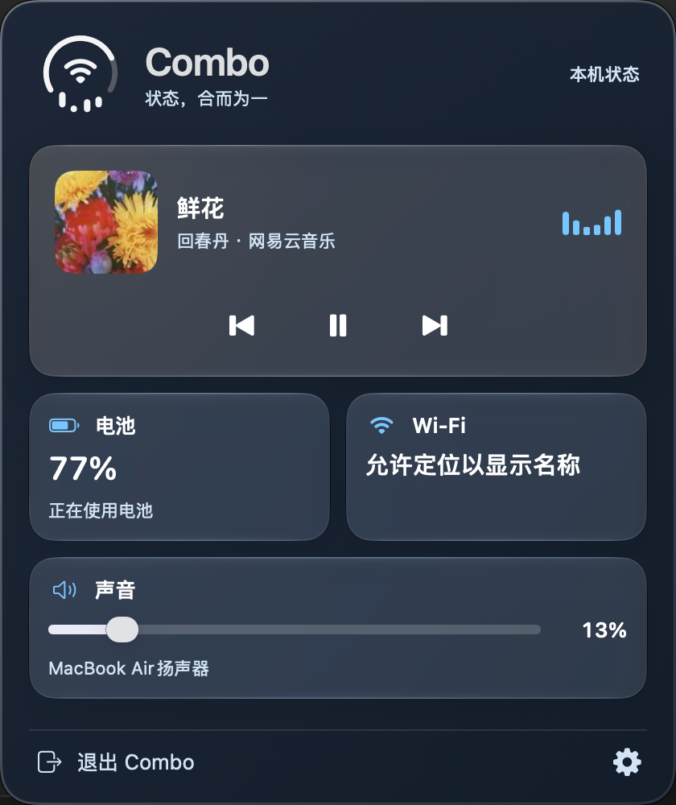

<p align="center">
  
</p>

<h1 align="center">Combo</h1>

<p align="center"><strong>电池、Wi-Fi、声音，一个菜单栏图标。</strong></p>

<p align="center">
  <a href="https://github.com/fanglinwei/Combo"></a>
  <a href="https://github.com/fanglinwei/Combo/releases"></a>
  <a href="https://github.com/fanglinwei/Combo/releases"></a>
  <a href="LICENSE"></a>
  <a href="#系统要求与安装"></a>
  <a href="#从源码构建"></a>
</p>

<p align="center">
  <a href="README.md">English</a> · 简体中文
</p>

<p align="center">
  <a href="https://github.com/fanglinwei/Combo/releases">版本发布</a> ·
  <a href="#快速开始">快速开始</a> ·
  <a href="#从源码构建">从源码构建</a> ·
  <a href="https://github.com/fanglinwei/Combo/issues">反馈问题</a>
</p>

Combo 是一款 macOS 菜单栏应用，让你查看电量、连接 Wi-Fi、调节音量和控制媒体播放。

## 界面预览

### 菜单栏中的 Combo

<p align="center">
  
</p>

[静态预览](docs/assets/combo-menu-bar-preview.png)

### Combo 面板

<p align="center">
  
</p>

Combo 面板将 macOS 的 Wi-Fi、电池和声音控制集中在一处，方便连接网络、查看电量、调整支持的电池选项，以及调节音量和切换输出设备。

### 菜单栏图标动效

| 连接 Wi-Fi | 充电与播放 | 使用 AirPods 听音乐 | 调节 AirPods 音量 |
| :---: | :---: | :---: | :---: |
|  |  |  |  |

动图使用应用自身的图标绘制逻辑与演示数据合成。更多示例见[图标状态图集](docs/combo-current-states.md)。

## 功能

- **状态图标**：外圈显示电量，中央显示网络或音频设备，底部显示音量或播放状态。低电量变红，充电时变绿。
- **电池**：查看电量、充电状态、健康信息和可读取的充电上限，切换支持的能耗模式。接通电源且手动充电上限暂停充电时，可用「立即充满电」临时解除上限，之后由 macOS 管理恢复。
- **Wi-Fi**：开关 Wi-Fi、浏览和连接网络，使用已保存的密码，或选择在本机记住密码。个人热点和企业认证通过 macOS Wi-Fi 设置完成连接。
- **声音与 AirPods**：切换输出、调节音量和静音；在设备支持时查看 AirPods 电量、切换降噪等模式。可查找附近 AirPlay 设备，并通过 macOS 声音设置连接。
- **媒体控制**：查看曲目、封面和来源应用，控制上一首、播放／暂停和下一首，也可打开来源应用。需要播放器向 macOS 提供媒体信息和对应控制。
- **个性化**：三种主题色、深浅外观、中英界面和登录时启动。播放音柱按固定节奏循环，可关闭动效，并遵循系统的「减少动态效果」设置。设置中提供 16 种图标预览；主动开始菜单栏演示后，关闭设置即可结束。

部分功能取决于设备和 macOS 版本，详见[兼容性说明](#兼容性说明)；授权与密码存储见[权限与隐私](#权限与隐私)。

## 系统要求与安装

- **macOS 26.0 或更新版本。** 部分集成功能有更窄的[兼容范围](#兼容性说明)。
- **目前已验证的开发环境为 Apple Silicon。** Intel 兼容性尚未验证，构建脚本只生成当前构建机器架构的应用。
- **电池信息与充电控制需要具有可读取内置电池的 MacBook。**

### 版本发布

在 [GitHub Releases](https://github.com/fanglinwei/Combo/releases) 查看已发布的安装包和版本说明。

**1.0.0 安装包正在准备，目前尚未发布可下载的 Release 资源。** 安装包发布前，请使用下方的[源码构建方式](#从源码构建)。下载时请查看对应版本说明中的架构支持和签名状态。

### 手动下载安装

Release 安装包发布后，可按以下步骤安装：

1. 从 [Releases](https://github.com/fanglinwei/Combo/releases) 下载适合你的 Mac 的安装包。Apple Silicon 选择标注为 `arm64` 或 Apple Silicon 的版本；Intel 支持目前尚未验证，仅在对应版本明确提供并支持 Intel 安装包时使用。
2. 根据实际发布格式，解压 `.zip` 或打开 `.dmg`。
3. 将 **`Combo.app`** 拖入**「应用程序」**文件夹（`/Applications`）。覆盖安装已有版本前，请先退出 Combo。
4. 从**「应用程序 → Combo」**打开应用，在菜单栏找到图标并完成首次引导。Combo 是菜单栏应用，不显示 Dock 图标。

### 首次打开被 macOS 拦截

> [!IMPORTANT]
> 当前本地构建使用 **ad-hoc 签名**，尚未配置 Developer ID 签名与 Apple 公证；对应发布版本的签名状态请以版本说明为准。以下路线适用于从本仓库 Releases 下载并确认可信的 Combo 副本。

**按顺序排查，能打开后即可停止，接着阅读[快速开始](#快速开始)。**

#### 第 1 步：确认安装位置并尝试打开

1. 确认 `Combo.app` 已放入「应用程序」文件夹，而不是仍在压缩包或磁盘映像中。
2. 在 Finder 中打开「应用程序」，双击 `Combo.app`。
3. 根据结果继续：能打开并看到菜单栏图标，安装完成；提示「无法验证开发者」或「Apple 无法检查是否包含恶意软件」，进入第 2 步；提示「已损坏」，直接进入第 4 步重新下载安装包。

#### 第 2 步：在系统设置中允许打开

1. 在拦截弹窗中点击「完成」或「好」，保留应用。
2. 打开「系统设置 → 隐私与安全性」，向下滚动到「安全性」区域。
3. 找到 Combo 被阻止打开的提示，点击「仍要打开」，按提示完成身份验证，再确认「打开」。
4. 回到「应用程序」再次打开 Combo。看到菜单栏图标即可开始使用；没有「仍要打开」按钮或仍被拦截时，进入第 3 步。

系统设置中的放行步骤参考 [Apple 官方指引](https://support.apple.com/zh-cn/102445)。

#### 第 3 步：在终端移除下载隔离属性

1. 按 `Command-Space` 打开 Spotlight，搜索「终端」并打开。
2. 复制下面的命令，粘贴到终端，按回车执行：

   ```sh
   xattr -dr com.apple.quarantine "/Applications/Combo.app"
   ```

3. 如果没有报错，回到「应用程序」重新打开 Combo。命令成功时通常不会显示输出；能打开即可停止排查。
4. 如果提示 `Permission denied` 或 `Operation not permitted`，可使用管理员授权重试：

   ```sh
   sudo xattr -dr com.apple.quarantine "/Applications/Combo.app"
   ```

   按提示输入 Mac 登录密码，再按回车；输入时终端不会显示字符。
5. 如果提示 `No such file`，确认应用已放入 `/Applications`；安装在其他位置时，将命令中的路径改为实际位置。如果仍打不开，进入第 4 步。

这一步移除的是 `Combo.app` 的下载隔离属性。重新下载或覆盖安装后，隔离属性可能再次出现。

#### 第 4 步：仍打不开或提示「已损坏」

1. 从 [Releases](https://github.com/fanglinwei/Combo/releases) 重新下载适合本机的安装包。退出已有 Combo，用新副本替换「应用程序」中的旧副本，再尝试打开。
2. 如果新副本仍无法打开，在终端执行以下只读命令，检查应用及其内嵌代码的签名：

   ```sh
   codesign --verify --deep --strict --verbose=2 "/Applications/Combo.app"
   ```

3. 校验通过但仍被拦截时，回到第 2 步检查系统放行状态。校验失败时，将完整错误、macOS 版本和 Combo 发布版本附到 [Issues](https://github.com/fanglinwei/Combo/issues)；也可以使用[源码构建](#从源码构建)生成本机副本。

<details>
<summary>可选：本地 ad-hoc 重新签名（进阶排查）</summary>

仅在重新下载后仍有签名错误、确认应用来源可信，且内嵌辅助程序的签名完整时，用于尝试修复外层应用签名。正常安装无需执行此步骤。

1. 退出 Combo。
2. 在终端执行：

   ```sh
   sudo codesign --force --sign - "/Applications/Combo.app"
   ```

3. 按提示输入 Mac 登录密码，随后重新执行第 4 步的签名校验命令。
4. 校验通过后，再从「应用程序」打开 Combo；如仍被拦截，回到第 2 步。校验仍失败时，请反馈错误或从源码构建。

本地重新签名可能导致定位、蓝牙或辅助功能等权限需要重新授权。它不能替代 Developer ID 签名与 Apple 公证，也不保证系统升级或覆盖安装后不再提示。签名方法参考 [Apple 的代码签名说明](https://developer.apple.com/documentation/xcode/creating-distribution-signed-code-for-the-mac)。

</details>

## 快速开始

1. **打开面板。** 启动 Combo，点击菜单栏图标。首次使用可跟随引导，也可从「设置 → 通用」重新查看。
2. **使用所需功能。** 选择电池、Wi-Fi 或声音，或控制当前媒体播放；按需授予相关权限。
3. **调整偏好。** 点击齿轮设置外观、语言和登录时启动；「菜单栏与控制」提供手动隐藏系统图标的指引。

关闭设置窗口后，Combo 继续运行。系统图标设置仅在你明确请求时恢复。

## 权限与隐私

**数据留在本机。** Combo 不上传设备状态、网络列表或 Wi-Fi 密码。媒体功能只读取系统媒体会话，不录音、不读取网页内容；定位权限不用于读取坐标。AirPlay 发现会使用本地网络。

根据需要使用的功能授权即可，可跳过可选功能，之后在系统设置中管理权限。

| 权限或授权 | 何时需要 |
| --- | --- |
| 定位 | 按 macOS 要求，显示 Wi-Fi 名称、扫描附近网络。 |
| 蓝牙 | 识别已连接音频设备，使用支持的耳机电量与聆听控制。 |
| 本地网络 | 启用附近 AirPlay 发现后，查找本地设备。 |
| 钥匙串 | 使用已保存的 Wi-Fi 密码，或记住手动输入的密码。 |
| 辅助功能 | 可选的系统图标显示设置记录、恢复与菜单诊断。 |
| 管理员授权 | 修改当前电源类型的能耗模式。 |

**Wi-Fi 密码**：手动输入的密码只在连接成功且选择记住后，保存在本机 Combo 钥匙串中，可随时删除。系统保存的密码仅用于所选网络的当次连接，不复制到 Combo 存储。取消或拒绝访问后，本次运行会停止后续系统密码请求。

**辅助功能是可选权限**：基本状态显示无需此权限。授权本身不会改变系统图标；隐藏由你手动完成，恢复记录需要明确操作。

## 兼容性说明

最低 macOS 版本是应用的部署要求。设备控制与集成功能还取决于硬件能力和系统接口是否可用。

| 功能 | 当前范围 |
| --- | --- |
| 个人热点详情 | 详细发现仅在已验证的 macOS 构建 `26A428` 上启用；其他构建保留系统 Wi-Fi 设置入口。 |
| 高耗能应用 | 仅在 Apple Silicon、macOS 构建 `26A428` 及预期系统配置下启用。使用系统近期能耗报告，不提供瓦数测量或独立排行榜。 |
| AirPods 控制 | 按设备与系统能力启用。私有接口在构建 `26A428` 上验证，尚未确立所有型号及 macOS 版本的支持范围；空间音频在系统设置中管理。 |
| 充电控制 | 仅在实时状态允许时临时解除支持的手动上限。不支持永久编辑充电上限，也不支持仅由优化电池充电造成的暂停。 |
| AirPlay 发现 | 浏览 `_airplay._tcp`。仅广播 `_raop._tcp` 的设备，包括部分 AirPlay 1 设备，不在当前发现范围；附近设备连接使用系统设置。 |
| 网络图标 | 表示默认网络路径与连接介质。菜单栏 Wi-Fi 图形不测量信号强度，也不检测互联网连通性；信号等级显示在网络列表中。 |
| 输出音量 | 取决于输出设备的控制能力；无法从 Mac 调整时，请使用设备自身的音量控制。 |

媒体播放、AirPods、AirPlay 路由详情、个人热点及部分电池功能使用私有系统接口，可能随 macOS 更新变化。无法取得信息或执行操作时，Combo 会显示不可用状态，或保留相关系统设置入口。

实现和设备说明：[电池控制](docs/battery-controls.md)、[声音与 AirPods](docs/airpods-audio-feasibility.md)、[AirPlay](docs/airplay-homepod-icon-research.md)、[个人热点](docs/mobile-hotspot-api-feasibility.md)。

## 常见问题

**为什么看不到 Wi-Fi 名称？**

在系统设置中检查 Combo 的定位权限，然后返回应用刷新。本地 ad-hoc 重新构建可能改变应用的签名身份，需要重新授权。

**为什么没有识别播放器，或播放音柱没有动？**

播放器需要向 macOS 报告媒体会话。请检查是否正在播放、Combo 是否开启播放动效，以及系统是否启用了“减少动态效果”。静音状态优先于播放音柱；音柱表示播放状态，不跟随声音波形。

**为什么 AirPods、个人热点或某项电池控制不可用？**

请检查上方的权限与兼容性说明。部分能力需要支持的设备或经过验证的特定系统构建。无法直接操作时，可以使用对应的系统设置入口。

**辅助功能开关已开启，Combo 仍提示无法访问？**

先退出并重新打开应用。如果重新构建或移动了本地签名的副本，请在权限列表中移除旧 Combo，再添加当前正在运行的副本。

**退出 Combo 后，系统图标会自动回来吗？**

如果有初始记录，请使用 Combo 的明确恢复操作；也可以在 macOS 设置中重新打开这些图标。退出应用不会自动恢复记录值。

## 从源码构建

### 开发环境

使用包含 macOS 26 SDK 或更新 SDK 的完整 Xcode。目前开发环境为 **Xcode 27.0**。项目使用 Swift、SwiftUI、AppKit，并打包 Objective-C/C 辅助程序；没有第三方 Swift 包依赖。

```sh
git clone https://github.com/fanglinwei/Combo.git
cd Combo
open Combo.xcodeproj
```

在 Xcode 中选择 **Combo** scheme，并在本机运行。Debug 启动后自动打开设置；Release 使用首次启动引导。

### 命令行构建

在仓库根目录执行：

```sh
# Debug
./build.sh

# Release
COMBO_CONFIGURATION=Release ./build.sh
```

脚本默认使用 `/Applications/Xcode.app/Contents/Developer`。如果 Xcode 安装在其他位置，请将 `COMBO_DEVELOPER_DIR` 设置为对应的 `Contents/Developer` 路径。脚本只构建本机架构，不生成 Universal 安装包。

构建产物位于 Xcode DerivedData 下的 `Build/Products/Debug` 或 `Build/Products/Release`。可在 Xcode 中使用 **Product → Show Build Folder in Finder** 定位。

### 验证

```sh
./verify.sh
```

脚本会构建 Debug，并运行状态、本地化、图标、面板、网络、电池、媒体及辅助程序检查，最后验证代码签名与品牌资源。真实设备连接、硬件相关控制和系统权限弹窗仍需要手动验证。

## 反馈与贡献

通过 [GitHub Issues](https://github.com/fanglinwei/Combo/issues) 报告问题或提出具体改进建议。设备相关问题请附上 macOS 版本与构建号、Mac 型号和芯片、Combo 版本、相关设备、权限状态及复现步骤。日志与截图中的网络密码和其他敏感信息请先移除。

代码改动请保持范围明确，运行 `./verify.sh`，并说明真实硬件上验证的行为。更新用户文档时，请同步维护中英文 README。

## 致谢

感谢为 Combo 实现研究提供参考的项目：

- [mediaremote-adapter](https://github.com/ungive/mediaremote-adapter)：macOS 媒体会话读取参考。
- [Ampere](https://github.com/az-code-lab/ampere) 与 [OpenDente](https://github.com/killerk3emstar/OpenDente)：原生电池及充电行为参考。

## 许可证

Combo 采用 [MIT 开源协议](LICENSE)。
