# Combo 当前图标状态与变化

以 2026-09-29 当前工作树为准。设置中的 `Scene` 有 **本机状态 + 16 个演示场景**；本机状态由电量、网络、音频和临时提示实时组合，无法用一张固定图代表。以下 19 个循环 GIF 使用应用的 `Snapshot.demo`、`IconContent`、`IconTransition` 和 `IconRenderer` 绘制：16 个场景各展示一次进入，再补连接成功、连接失败和取消静音。画面是确定性的演示数据，没有修改真实系统状态。

## 状态如何叠加

| 区域 | 当前规则 |
| --- | --- |
| 外圈 | Mac 电量决定弧长；低于 20% 时红色；正在充电时绿色并显示闪电。仅接通电源不等于正在充电。 |
| 中央 | 临时插拔电或音量提示（P4）→ Wi-Fi 连接中（P3）→ Wi-Fi 关闭、网络异常、未知、电量或 AirPods（P2）→ 普通 Wi-Fi（P1）。充电或电量低于用户设定阈值时，电量数字可优先于普通 Wi-Fi；默认阈值是 50%。 |
| 底部 | 静音符号 → 调音量时的音量点 → 播放音柱 → 普通音量点。音量未知时显示短横线；音量为 0 也按静音显示。 |
| 动效 | 普通播放音柱按 1.2 秒循环；开启“减少动态效果”后停在固定形态。关闭 Combo 的播放动效后，播放时保留音量点。 |

同级中央内容切换或优先级下降时，中心约 **0.23 秒交叉淡化**。优先级升高时通常先隐去旧图标，再放大新内容、停留并恢复外围，完整入场约 **4.7 秒**。减少动态效果下中央切换约 **0.16 秒**，只淡化、不缩放。网络连接有专门的放大和 Wi-Fi 形变；连接未结束时持续脉冲。音量提示保持约 **2 秒**，插拔电提示约 **9.2 秒**后回到当时的常驻内容。下列 GIF 以默认阈值、播放动效开启、深色外观展示；设置不同或实时数据不同，组合结果也会不同。

浅色外观使用同一套图形与状态规则，四个代表状态如下：

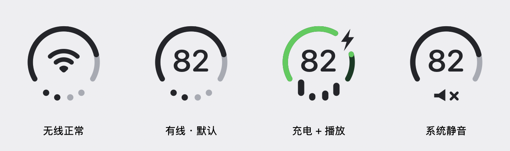

## 网络与中央内容

### 无线正常

有线默认内容 → Wi-Fi：中央变为无线图形，底部保持 50% 的两颗亮点。

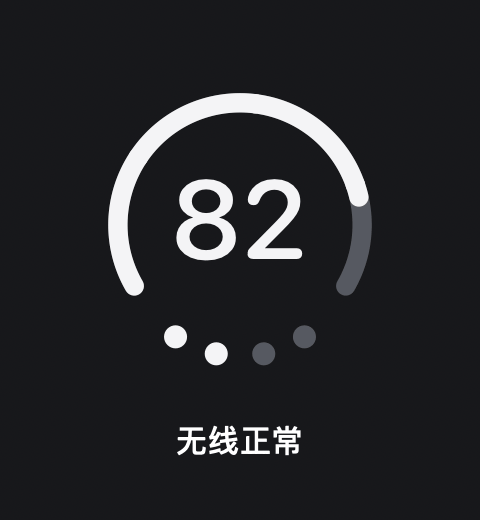

### 有线 · 默认

Wi-Fi → 有线默认内容：中央显示本机电量 `82`，不显示网口图标。

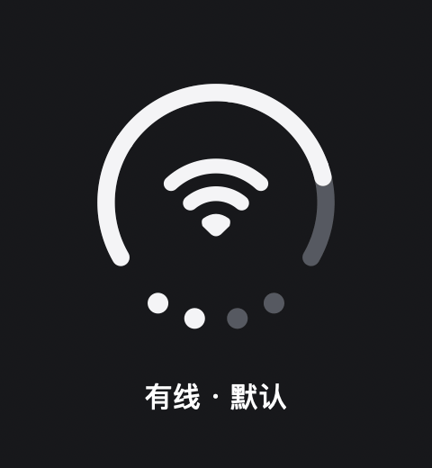

### Wi-Fi 正在连接

普通 Wi-Fi → 连接中：中央放大并循环脉冲，外圈和底部暂时隐藏；连接未结束就维持此状态。

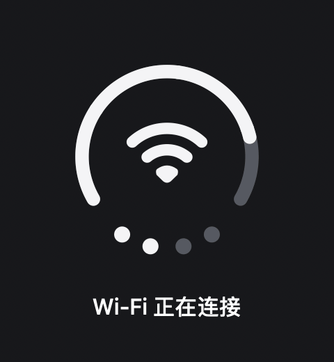

连接成功后直接回到当前 Wi-Fi 图标；明确无可用网络路径时转为异常图标。两条恢复路径分别如下。

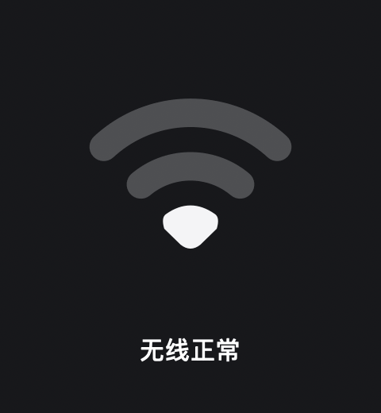

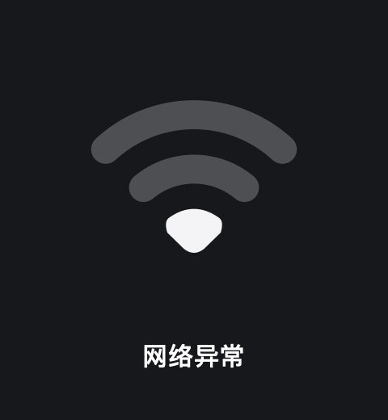

### Wi-Fi 已关闭

普通 Wi-Fi → 关闭：中央出现划线 Wi-Fi，底部仍显示音量。关闭也会中断正在连接的提示。

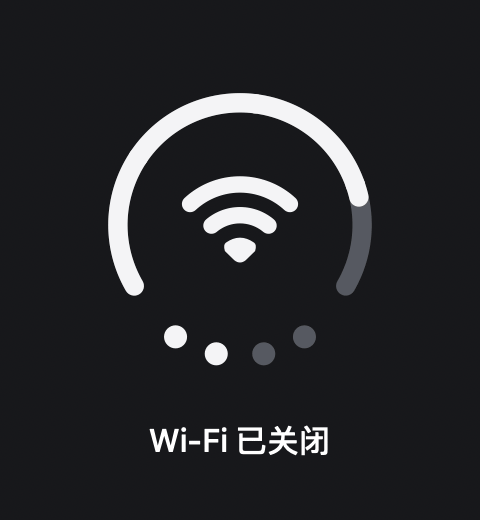

### 网络异常

普通 Wi-Fi → 明确无可用路径：中央显示带感叹号的 Wi-Fi 图形，不代表已检测到远端互联网故障。

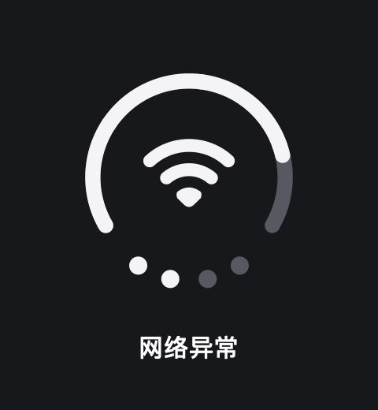

## 电量与供电

### 低电量

`82%` → `12%`：外圈变短并变红，中央数字同步变化。演示中低于默认的 50% 中央电量阈值。

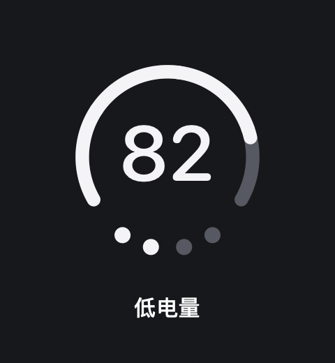

### 充电 + 播放

未充电播放 → 正在充电播放：外圈变绿，右上方出现闪电；底部音柱仍播放。

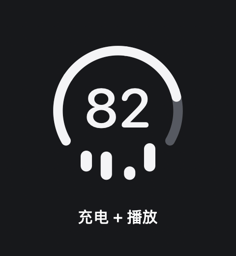

### 插入电源

常驻电量 → 插头与勾号提示；约 9.2 秒后中央回到当前常驻电量，保留充电外圈和闪电。提示在前，充电状态在外围同时更新。

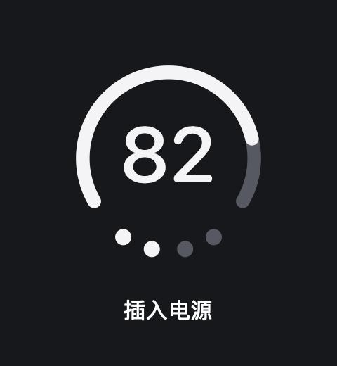

### 拔出电源

充电播放 → 插头与叉号提示；约 9.2 秒后回到未充电的普通 Wi-Fi 场景。GIF 使用演示快照说明提示规则。

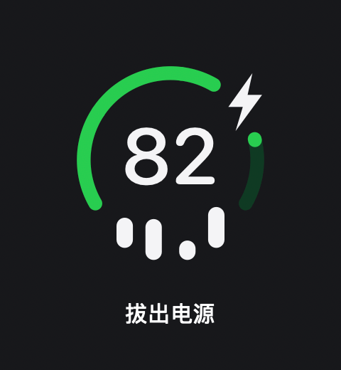

## 音频

### 媒体播放

未播放 → 播放：底部音量点变为四根固定节奏的音柱；不会读取音频波形。


### 暂停 / 未播放

播放 → 暂停：音柱收回为当前音量档位的圆点。


### AirPods 播放

Wi-Fi → AirPods 输出：演示中央显示 AirPods 符号，底部继续播放音柱。实际设备须能被可靠识别且为当前输出。

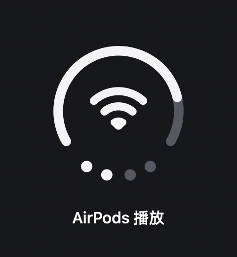

### 调整音量

AirPods 播放中调到 75%：中央临时显示 `75`，底部显示三颗亮点；约 2 秒后中央恢复 AirPods，底部恢复播放音柱。连续调音量只更新数值并延长提示，不反复播放入场。


### 系统静音

播放 → 静音：底部静音符号优先于播放音柱；此演示的中央常驻内容是电量数字。

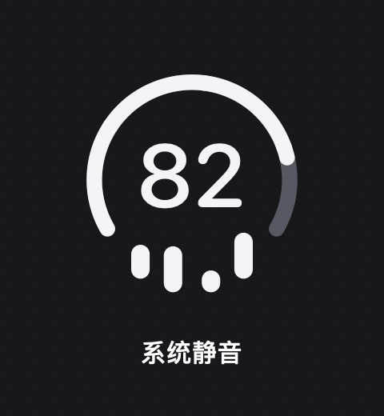

### Wi-Fi · 静音

普通 Wi-Fi → 静音：中央仍是 Wi-Fi，底部换成静音符号。取消静音后回到当前音量点或播放音柱，取决于当时是否播放。

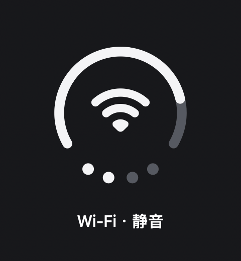

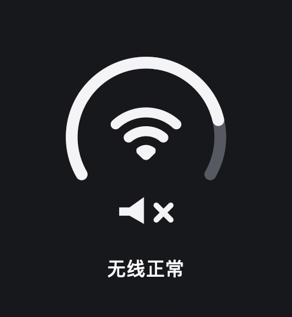

## 减少动态效果

播放中启用系统“减少动态效果”：音柱停在固定高低形态；中央转场只淡化。此 GIF 展示音柱从循环到静止。

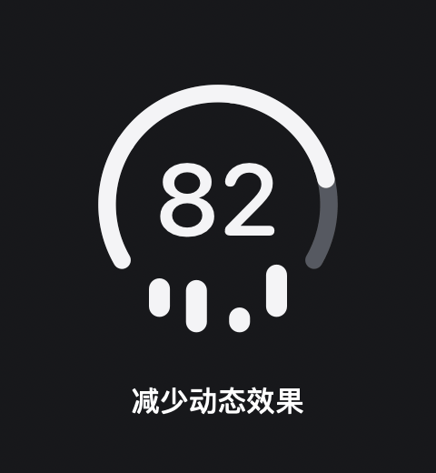

## 相关界面状态索引

这些分支会影响面板或设置界面，不会各自产生一种新的菜单栏图标，因此没有另做 GIF。

| 位置 | 当前分支 |
| --- | --- |
| 主面板 | 总览；电池、Wi-Fi、声音三个详情页。 |
| 设置窗口 | 通用、外观与动效、系统菜单整合、媒体来源、实验性项目、关于与帮助六页；外观可跟随系统、浅色或深色。 |
| 系统图标手动隐藏检查 | Wi-Fi、声音、电池各为“设置为显示”“设置为隐藏”或“无法判断”；读取和恢复期间有忙碌与结果提示。 |
| 媒体来源 | 正在播放、已暂停、未检测到播放、重新连接中。 |
| 个人热点与高耗能应用 | 读取中、不可用、可用；可用但列表为空时各有空状态说明。 |
| 充电上限 | 读取中、无法判断、未检测到活动上限、具体百分比、多个限制冲突。 |

这些界面分支见 [SettingsView.swift](../Combo/Views/SettingsView.swift) 与 [PanelView.swift](../Combo/Views/PanelView.swift)、[MenuBarSetup.swift](../Combo/MenuBar/MenuBarSetup.swift#L4-L11) 与 [State.swift](../Combo/App/State.swift#L171-L181)。

## 来源与重绘

- 场景与演示数据：[State.swift](../Combo/App/State.swift#L44-L139)。
- 中央选择、优先级、转场、绘制：[IconTransition.swift](../Combo/Rendering/IconTransition.swift) 与 [IconRenderer.swift](../Combo/Rendering/IconRenderer.swift)。
- 实时场景、阈值与提示到期：[Store.swift](../Combo/Stores/Store.swift) 与 [BatteryStore.swift](../Combo/Stores/BatteryStore.swift)。
- GIF 生成脚本：[render_current_states.swift](assets/render_current_states.swift)。它只生成文档资源，不修改应用或系统状态。

在仓库根目录重绘（使用与项目构建相同的 macOS 26 SDK）：

```sh
mkdir -p build
xcrun swiftc -sdk "$(xcrun --sdk macosx --show-sdk-path)" -target arm64-apple-macosx26.0 -swift-version 5 -parse-as-library Combo/App/State.swift Combo/Rendering/IconTransition.swift Combo/Rendering/WiFiIcon.swift Combo/Rendering/IconRenderer.swift docs/assets/render_current_states.swift -o build/render-current-states
./build/render-current-states
```

GIF 的起点由场景演示数据决定，循环回起点时会直接重置；实际应用会持续读取本机状态并从当时的画面转场。旧的 [设计总览](assets/combo-state-overview.png) 与 [播放示意](assets/combo-playback-demo.gif) 是早期设计稿，不包含这里的全部当前场景。
