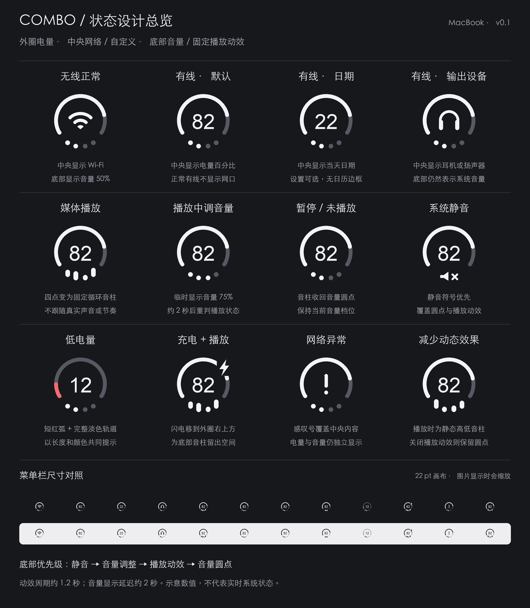

# Combo：MacBook 组合状态图标设计

文档修订：v0.4 · 2026-09-22（同步网络判断、媒体适配和实施方案；不是产品发布版本号）  
用途：产品设计与视觉交接；尚未实现 macOS 应用或连接真实系统状态。

## 1. 设计目标与范围

将 MacBook 电量、网络或自定义信息、音量或媒体播放状态组合为一个菜单栏图标。外形沿用参考图的底部开口圆弧、中央内容和底部四点，优先保证小尺寸辨识度。

**产品首版仅覆盖带内置电池的 MacBook，外圈只读取并显示本机电量。**台式 Mac 适配、iPhone 电量读取、AirPods／其他耳机电量读取统一移入[后续版本规划](combo-roadmap.md)，不作为首版实现或验收前提。

首版仍保留音频输出设备识别及可靠识别后的 Apple 耳机图标；“显示耳机图标”与“读取耳机电量”是独立功能。首版即使中央显示 AirPods，外圈也始终代表 MacBook 电量。参考图片只作为视觉参考，不将其产品名称或发布信息作为已核实事实。

## 2. 已确认的核心决策

| 区域 | 默认内容 | 变化规则 |
| --- | --- | --- |
| 外圈 | MacBook 电量 | 圆弧长度随电量变化，充电和低电量有状态提示 |
| 中央 | Wi-Fi 或用户指定内容 | 无线为主要连接时显示 Wi-Fi；有线正常时显示自定义内容；明确无可用网络路径时显示感叹号 |
| 底部 | 四个音量圆点 | 媒体正在播放时变为四根固定循环的圆角音柱 |

有线正常时，中央默认显示**电量百分比**。用户可改为**当天日期**或**音频输出设备**。不再使用此前被否定的有线网口图标，也不把它保留为第一版设置选项。

媒体动效只表达“正在播放”，不采集或分析音频，不跟随实际声音、音量大小或音乐节奏变化。音量调节和静音的显示优先级高于播放动效。

## 3. 外圈：电量

- 保留底部开口的圆弧结构。淡色轨道始终存在，亮起弧长表示电量。
- 电量减少时缩短亮弧，不改变轨道位置、整体尺寸或开口角度。
- 低电量用短弧和强调色共同表示，不只依靠颜色；本稿建议以 20% 为视觉阈值，数值属于设计初值。
- 正在充电时显示稳定闪电，不播放呼吸或旋转动画。仅接通电源但未充电时，不冒充“正在充电”；具体原因在面板中显示。
- **本稿布局调整：闪电移至外圈右上方，在局部留出底色间隙。**此前位于底部开口内的闪电会与音柱竞争空间，故不再沿用。闪电位置属于本稿待视觉评审的细节。

## 4. 中央：网络与自定义内容

### 4.1 显示规则

按以下顺序选择中央内容：

1. 已确认无可用网络路径：显示 `!`，点击面板查看具体情况；不据此断言远端互联网故障。
2. 网络状态尚未取得、等待连接或主要介质无法确定：显示短横线 `—`，面板说明原因，不能将未知状态冒充断网。
3. Wi-Fi 为主要上网连接：显示 Wi-Fi 图形，通过亮起层级表达无线信号强弱。
4. 有线为主要上网连接且正常：显示用户选定内容。

“主要连接”应由实际连接状态决定，不因插入网线就固定认定有线优先。两者同时连接时，只显示主要连接对应的内容；点击面板分别列出有线与 Wi-Fi 的连接状态，并标明主要连接。

Wi-Fi 信号强弱、连接是否建立、互联网是否可用是不同概念。不能仅凭信号满格或网线已插入就声称可正常上网。首版只检查连接与路由，不主动访问外部地址，面板明确显示“互联网未检测”。VPN、双栈路径冲突等无法确定主要介质时保留未知，不猜为有线。

### 4.2 自定义选项

| 选项 | 中央示例 | 规则 |
| --- | --- | --- |
| 电量百分比，默认 | `82` | 小尺寸图标省略百分号；提示和面板显示 `82%`；100% 显示 `100`，不截断 |
| 当天日期 | `22`、`07` | 固定两位日数；不加日历边框；完整日期在提示中显示 |
| 音频输出设备 | 可识别的 Apple 耳机使用对应产品图标，否则显示通用耳机或扬声器 | 表示当前输出设备类型，不代表配件电量；不增加重复音量声波 |

日期和百分比使用稳定的数字宽度。数字、Wi-Fi、耳机等图形保持接近的视觉分量与中心位置。内容不自动轮播，只有设置或实际场景变化时才切换。

未知音频设备可采用中性扬声器轮廓，并在面板中展示可获得的设备名称；不得猜测为某款耳机。

### 4.3 Apple 耳机图标（v0.2）

本功能中的“有线”指有线网络，不限制耳机必须有线连接。以太网正常时，当前音频输出可以是蓝牙 AirPods、USB 耳机或内置扬声器。

当用户选择中央显示“音频输出设备”时，以系统默认音频输出设备为准；仅已配对、已连接但未被选为输出的耳机，不应占用中央图标。若某个应用自行指定其他输出，本版不宣称图标代表该应用的实际输出。

| 识别结果 | 中央图标 |
| --- | --- |
| 可靠识别为 AirPods、AirPods Pro 或 AirPods Max 产品系列 | 优先使用系统提供的合适设备图标，或对应的 Apple SF Symbols 产品符号 |
| 确认为耳机，但型号不确定或无对应可用符号 | 通用耳机轮廓，不猜测 Apple 产品系列或代际 |
| 内置扬声器、其他输出设备 | 对应的通用设备符号；无法确认类型时使用中性扬声器轮廓 |

识别优先读取 Core Audio 提供的设备图标与型号信息。`kAudioDevicePropertyIcon` 返回可用于代表设备的图像 URL，`kAudioDevicePropertyModelUID` 提供型号标识；属性存在不等于每款设备都提供足够精细的信息。具体可识别系列需实机验证，不能承诺所有 Apple 耳机及代际均可区分。

设备名称可能被用户修改，不能仅通过名称包含“AirPods”就确定型号。普通模拟耳机连接或经转接器连接时，不应假定可识别实际耳机品牌；以可取得且验证过的设备信息为准。无可靠信息时直接回退，不调用私有接口补猜。

产品符号保持官方轮廓，使用适合菜单栏的单色呈现，在中央区域等比缩放；不截取用户截图作为正式图标，也不重画 Apple 产品符号内部形状。符号可用性按目标系统检查。输出设备切换时仅更新中央内容，外圈电量与底部音量／播放动效规则不变。

依据：[Core Audio 设备图标](https://developer.apple.com/documentation/coreaudio/kaudiodevicepropertyicon)、[型号标识](https://developer.apple.com/documentation/coreaudio/kaudiodevicepropertymodeluid)、[默认输出设备](https://developer.apple.com/documentation/coreaudio/kaudiohardwarepropertydefaultoutputdevice)、[SF Symbols](https://developer.apple.com/sf-symbols/)。图标定义同时核对了本机 SDK 的 `AudioHardwareBase.h`。

## 5. 底部：音量与播放动效

### 5.1 音量圆点

四个圆点沿底部弧线排列。未亮圆点保留淡色，位置和直径固定。具体音量数值放在提示和面板中。

建议映射为：0% 全部淡色；大于 0% 至 25% 亮一颗；大于 25% 至 50% 亮两颗；大于 50% 至 75% 亮三颗；大于 75% 至 100% 亮四颗。系统静音使用独立静音符号，不与 0% 混为同一状态。

当系统不提供当前输出设备的音量值时，显示短横线并在面板标明“音量不可读取／由设备控制”，不显示虚构的百分比。此项为本稿补充的未知数据规则。

### 5.2 固定播放动效

- 媒体正在播放时，四点向上伸长为四根圆角短柱，横向位置保持不变。
- 四柱按预设相位错峰起伏，所有媒体使用同一套循环。
- 建议周期约 1.2 秒；最长音柱约为圆点直径的两倍，最高处不碰中央内容。
- 暂停或播放结束时，音柱收回音量圆点；歌曲的安静片段不触发切换。
- 普通通知音、键盘音不作为媒体播放依据。以可识别的媒体“播放中”状态为准。Safari、Chrome 通过配套扩展观察已授权页面；网易云音乐、QQ 音乐先验证辅助功能适配，通过后才列为正式支持。不以音频输出活动代替播放状态。
- 动效关闭时始终显示音量状态。开启“减少动态效果”时，播放状态使用静态高低音柱。

### 5.3 显示优先级

| 优先级 | 条件 | 底部表现 |
| --- | --- | --- |
| 1，最高 | 系统静音 | 静音符号 |
| 2 | 正在调整音量，或距最后一次调整不足约 2 秒 | 音量圆点；若值不可读取，显示未知占位 |
| 3 | 媒体播放中且播放动效开启 | 固定循环音柱；减少动态效果时用静态音柱 |
| 4 | 其他情况 | 音量圆点；值未知时显示短横线 |

反复调节音量时，从最后一次变化重新计时。两秒到期后重新检查当前状态，不能无条件恢复动效：若已暂停，继续显示圆点；若静音，显示静音符号。

媒体状态未知时不猜测正在播放，回退到音量显示。中央网络异常不会停止底部已知的媒体播放状态，例如离线本地播放可同时显示 `!` 与音柱。

## 6. 交互与设置

整个组合图标使用一个点击区域，不要求分别点击外圈、中央或单个圆点。

- 悬停提示：给出当前内容的精确信息，例如“电量 82% · 有线网络 · MacBook 扬声器 · 音量 50%”。
- 点击面板：电量与充电状态；有线和无线各自连接情况；当前输出设备、音量滑块和静音操作；设置入口。
- 无法读取或调节的设备状态必须明确说明，对应控制不可伪装可用。

第一版设置保持精简：

| 设置 | 可选值／默认值 |
| --- | --- |
| 有线网络正常时，中央显示 | 电量百分比（默认）／当天日期／音频输出设备 |
| 播放媒体时显示动态音柱 | 默认开启，可关闭 |
| 媒体来源 | 当前在播来源与实时状态；菜单栏四个媒体的状态对照；各来源开关与授权指引移入后续版本 |

设置页同时展示放大预览和菜单栏尺寸预览。中央自定义只作用于有线正常场景，不覆盖 Wi-Fi 与网络异常提示。媒体来源未授权或不可用时仍显示音量，设置中说明原因；首次启动不集中请求媒体权限。第一版不提供圆点功能任意拼装、图形自动轮播或自定义动画曲线。

首版不提供关联设备电量来源选择、手机 USB 配对／无线连接引导或外部电量扫描设置，也不因耳机或手机连接而切换外圈来源。

## 7. 视觉与可访问性

- 默认单色、透明背景，适应深浅菜单栏；低电量才使用强调色。
- 不添加常驻胶囊底色、装饰阴影、渐变或循环呼吸效果。
- 以约 22 pt 的图标画布作为起点，在真实菜单栏中校准笔画与间距。文档图片随查看比例缩放，不能替代实机验收。
- 外圈、中央、底部保持分区；仅底部音柱在媒体播放时持续运动。
- 对读屏提供完整状态描述；不要按动画帧更新读屏播报。
- 尊重系统减少动态效果偏好。文字标签、符号形状共同表达状态，不能只靠颜色。

## 8. 状态设计图

总览包含：无线正常、有线默认百分比、有线日期、有线输出设备、媒体播放、音量调整、暂停、静音、低电量、充电与播放并存、网络异常、减少动态效果。

现有总览图为 v0.1 的通用耳机示例，仍用于展示布局与回退状态。v0.2 新增的 Apple 产品图标规则见 4.3 节；该图不代表已识别或已绘制具体 AirPods 型号。

动图用固定循环展示播放状态。四柱相位与节奏预设，不反映实际音频。动图是放大设计示意，不代表已经实现系统播放检测。

## 9. 验收场景

| 场景 | 预期结果 |
| --- | --- |
| Wi-Fi 正常，未播放，音量 50% | 外圈电量 + Wi-Fi + 两亮两淡圆点 |
| 有线正常，保持默认设置 | 中央显示电量数字，无网口符号 |
| 有线与 Wi-Fi 同时连接 | 按主要连接选中央内容；面板仍列出两条连接 |
| 有线正常，切换日期或输出设备 | 仅中央改变，外圈与底部保持原有含义 |
| 中央显示 AirPods，或连接了 iPhone | 外圈仍为 MacBook 本机电量，不读取关联设备电量 |
| 媒体播放开始 | 底部变为固定循环音柱，不随歌曲或音量改变节奏 |
| 播放中调整音量 | 显示圆点，最后一次调整约 2 秒后再判断是否恢复音柱 |
| 调整音量后立刻暂停 | 超时后仍为圆点，不错误恢复音柱 |
| 播放中静音／取消静音 | 静音符号优先；取消后按当前播放及音量调整状态恢复 |
| 开启减少动态效果 | 播放中为静态高低音柱，无循环动画 |
| 关闭播放动效 | 播放时仍显示音量圆点，静音规则不变 |
| 网络异常但本地媒体仍在播放 | 中央 `!`，底部继续音柱，两区独立 |
| 充电且正在播放 | 闪电与中央、音柱均不重叠 |
| 电量 0%、100%，音量 0%、100% | 边界值正确，数字不裁切，圆点档位无歧义 |
| 网络、媒体或音量数据未知 | 显示明确占位或按规则回退，不伪造正常／异常状态 |

## 10. 明确不纳入本版

- 网口图标，以及有线和 Wi-Fi 图形叠加。
- 真实音频波形、频谱、系统音频采集或随歌曲节奏变化的动画。
- 底部显示亮度、配件电量、任务进度或多个独立开关状态。
- 中央显示完整时间、专注模式、CPU、天气等扩展内容。
- 台式 Mac 适配及无电池布局，移入后续版本。
- iPhone 电量／充电状态读取、配对与网络查询，移入后续版本。
- AirPods／其他耳机的左右耳、充电盒电量读取及关联设备电量选择，移入后续版本。

以上延期能力、已有技术证据和仍需决定的台式机规则统一记录在[后续版本规划](combo-roadmap.md)。相关调研不构成首版任务。

## 11. 开发前需验证与视觉评审项

已确认的是产品行为与第一版范围，不是特定 macOS API 的可用性。开发前应验证：媒体播放状态来源及多应用同时播放的汇总策略；主要网络连接和网络异常的识别；Wi-Fi 信号读取；音频设备状态与音量控制能力；相关权限。平台已确定为 macOS 26 及以上、独立分发，详见[开发实施文档](combo-implementation.md)。不能把“已连接”直接等同于“互联网可用”。

本稿采用的 20% 低电量阈值、约 22 pt 画布、约 1.2 秒动效周期、约 2 秒音量显示延迟及闪电新位置，均为可评审、可调节的设计初值。其中 1.2 秒与 2 秒沿用此前讨论建议。正式开发前用实机校准，不将设计图视为已完成像素级验收。

## 12. 产物与重绘

- `combo-design.md`：本设计文档。
- `assets/combo-state-overview.png`：完整状态总览。
- `assets/combo-playback-demo.gif`：固定循环动效示意。
- `assets/render_design.py`：重绘脚本，需要 Python 与 Pillow。
- [combo-roadmap.md](combo-roadmap.md)：后续版本规划及调研入口。

在仓库根目录运行 `python3 docs/assets/render_design.py` 可重绘；脚本同时检查动画周期一致性、状态分区隔离和输出文件完整性。绘图检查不等同于 macOS 产品功能测试。

## 13. 开发实施入口

[combo-implementation.md](combo-implementation.md) 包含已确认需求、权限矩阵、系统接口、媒体适配门槛、架构、UI 线框与开发验收步骤。现有总览图中“网络异常”按本文解释为明确无可用路径，不代表已实施互联网探测。

## 14. 可选系统菜单整合（新增确认）

用户主动启用后，将 **Wi-Fi、声音／AirPods、电池** 纳入折叠目标，三个系统项仍保持启用。左键 Combo 打开面板，再点击对应入口：临时展开真实图标、转交系统原生菜单、关闭后归位收起。电池行始终保留系统电池菜单入口，不受中央百分比／日期／耳机设置影响。

这是待能力验证的增强功能，默认关闭；辅助功能用途包含操作菜单。不可用时停止折叠并提供恢复指引，基础状态照常工作。日期属于系统时钟，用户提出的日期折叠另作验证，不混同于已经确认的三个目标。详细流程与验证顺序见[系统菜单整合计划](menu-integration-plan.md)。

## 15. 设置界面（已确认）

设置使用独立窗口和左侧五组导航：通用、图标与动效、系统菜单整合、媒体来源、关于与帮助。登录时启动默认关闭；系统菜单整合总开关默认关闭，Wi-Fi、声音／AirPods、电池可分别选择，初始均选中。日常面板与设置分开，具体控件、权限状态和默认值见[设置界面规格](combo-settings.md)。本节及链接规格补充第 6 节早期设置清单。
