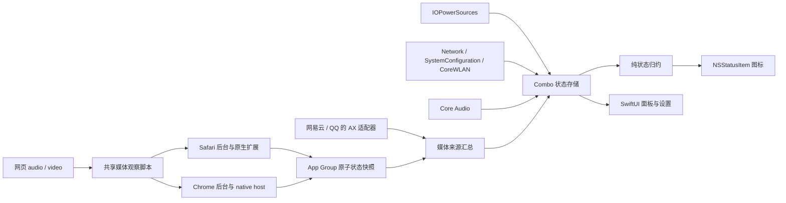

# Combo 首版开发实施文档

修订：v0.1 · 2026-09-22  
状态：需求与实施方案交接。尚未创建或验证 macOS 应用；文中的 API 证据不等于签名安装包实测通过。

## 1. 已确认的实施边界

| 决策 | 首版约定 |
| --- | --- |
| 硬件、系统 | 有内置电池的 MacBook，macOS 26 及以上 |
| 分发 | 独立安装包，Developer ID 签名、公证；不以 Mac App Store 为首发渠道 |
| 外圈 | 只显示本机电池，不读取手机、耳机电池 |
| 中央 | 主要连接为 Wi-Fi 时显示无线信号；有线时默认电量百分比，可选日期、输出设备 |
| 网络判断 | 只检测连接和路由，不访问外部检测地址；面板明确“互联网未检测” |
| 底部 | 默认四点音量；已确认媒体播放时为固定音柱，不采集声音、不跟随节奏 |
| 播放语义 | 保留严格播放／暂停状态，不能用音频输出活动替代 |
| 浏览器 | Safari + Chrome，用户接受配套扩展及网站授权 |
| 桌面播放器 | 网易云音乐、QQ 音乐；接受辅助功能权限，先验证，后确定正式支持版本 |
| 后续版本 | 台式 Mac、iPhone 电量、AirPods 电量，见 [路线图](combo-roadmap.md) |

Apple Music、Spotify 仅作为技术调研中的对照，不自动加入首版工作量。网易云音乐、QQ 音乐是适配目标，当前不能写为“已支持”。无法可靠取得状态时显示不可用，不伪装为暂停，也不暗中切换私有接口或音频活动检测。

视觉行为以 [设计文档](combo-design.md) 为依据。本文件补足实现方式、授权流程、兼容性边界和交付门槛。

## 2. 权限设计

### 2.1 用户授权与签名配置分开处理

| 功能 | 用户需要做什么 | 实施及回退 |
| --- | --- | --- |
| 本机电量 | 不设计额外隐私授权 | IOPowerSources；读取失败显示未知 |
| 路径、接口、Wi-Fi RSSI | 不为这些功能主动请求定位或本地网络 | Network / SystemConfiguration / CoreWLAN；读取失败单独降级 |
| 系统默认输出、音量读写 | 不请求麦克风或系统音频录制 | Core Audio 属性读写；设备不支持时禁用对应控制 |
| 网易云、QQ 音乐界面状态 | 用户主动开启桌面适配后授予“辅助功能” | 直接使用 AX API；拒绝后基础功能正常，桌面播放识别不可用 |
| Safari 媒体 | 启用 Safari 扩展，并允许目标网站访问 | 网站未授权不检测；扩展失联清除旧状态 |
| Chrome 媒体 | 安装扩展，允许目标网站访问，启用本地连接 | nativeMessaging 为扩展声明；不等于 macOS 隐私弹窗 |
| App Group | 无单独用户授权弹窗 | 主应用、Safari 原生扩展及必要 helper 的签名 entitlement；集成验证必须通过 |

首版不显示 SSID/BSSID，不申请定位；只显示“Wi-Fi 已连接”和可取得的信号。RSSI 返回无效值时不能画成满格。后续若增加网络名，再单独设计定位用途和授权。

直接通过 `AXUIElement` 读界面，不经 System Events 执行 UI 脚本，所以当前方案不额外请求“自动化”。若以后加入 AppleScript 播放器适配，才增加 `NSAppleEventsUsageDescription`、Hardened Runtime Apple Events entitlement 及逐目标授权；不能为未实现的能力预先申请。

首版不需要麦克风、屏幕录制、系统音频录制、照片、通讯录、Apple Music 媒体库、蓝牙扫描、完全磁盘访问或手机局域网发现权限。不为动效创建音频 tap。

### 2.2 辅助功能授权流程

1. 首次启动直接展示本机状态，不弹授权串。
2. 用户进入“设置 → 媒体来源”，开启网易云音乐或 QQ 音乐适配。
3. 解释：“读取所选播放器的播放／暂停控件，用于显示播放动效；不点击控件，不录制音频。”
4. 调用 `AXIsProcessTrustedWithOptions` 发起系统提示，引导至系统设置。辅助功能授权作用于 Combo，不是系统提供的某播放器专属只读权限，界面不能如此宣称。
5. 用户返回后重新检查授权；拒绝或撤销时停止 AX 查询，显示恢复入口，不循环弹窗。

代码按目标进程 PID 创建 AX 对象，只读取已验证控件的角色、标识与状态。禁止全桌面文本扫描、截图 OCR、模拟点击、为读取状态自动启动或激活播放器。授权较广，程序自身必须限定访问范围。

## 3. 最小技术架构

主应用采用 Swift + AppKit + SwiftUI，优先系统框架，不引入跨平台 UI、数据库或常驻网络服务。推荐主应用非 App Sandbox、开启 Hardened Runtime；Safari 原生扩展按其平台要求使用沙盒及共享组。非沙盒不豁免 TCC。



### 3.1 工程组成

| 组成 | 单一职责 |
| --- | --- |
| Combo.app | 系统监听、AX 读取、来源聚合、显示归约、菜单栏和设置 |
| Safari Web Extension | 授权页面媒体观察、后台聚合、原生消息处理 |
| Chrome Extension | 共用媒体观察逻辑；Chrome 专用后台桥接 |
| Chrome native host | 校验协议，把状态写入共享容器，不读取网页或控制播放器 |

浏览器脚本共享业务逻辑，各自保留 manifest 与桥接。先用具体类型和简单状态存储，不搭建动态插件系统、依赖注入框架或通用事件总线。不同播放器的控件定位规则独立，避免一个应用升级牵连另一个。

### 3.2 数据边界

- `BatterySnapshot`：可空百分比、电源来源、是否充电、更新时间、可用性。没有数据不等于 0%。
- `NetworkSnapshot`：路径可用性、主要介质 wifi/ethernet/other/ambiguous/unknown、可空 RSSI、更新时间。互联网状态固定为 notChecked。
- `AudioSnapshot`：默认输出设备 ID、名称、图标识别结果、可空音量/静音、读写能力。
- `MediaSourceSnapshot`：来源、进程或会话标识、playing/paused/ended/buffering/unknown/unavailable、原因、序号、更新时间。
- `Preferences`：有线中央内容、播放动效开关、各媒体来源启用状态。使用 UserDefaults。

系统回调先在各自串行队列处理，再向 `@MainActor` 状态存储发布不可变快照。AX/文件读取不阻塞主线程；界面只消费归约后的状态。移除监听、进程退出、休眠及唤醒均有明确清理路径。

## 4. 系统状态采集

### 4.1 电池

使用 `IOPSCopyPowerSourcesInfo`、`IOPSCopyPowerSourcesList`、`IOPSGetPowerSourceDescription`，筛选内置电池，不把 UPS 或外接设备当作本机电池。容量仅在分母大于零且数据有效时计算百分比，约束至 0–100。订阅 `IOPSNotificationCreateRunLoopSource`，唤醒后重新读取。

接通电源与正在充电分别处理；“未充电”不擅自解释为保护电池或温度限制。缺少具体原因时只显示系统可证明的信息。无内置电池提示“首版仅支持 MacBook”，不启用未经确认的台式机替代布局。

### 4.2 网络

`NWPathMonitor` 判断路径可用性；`SCDynamicStore` 的全局 IPv4/IPv6 主接口辅助确定介质；按真实接口类型映射，不硬编码 en0。双栈介质冲突、VPN 隧道、多路径等证据不充分时保留 ambiguous。

显示规则：

1. 明确无可用路径：中央 `!`，面板“无可用网络路径”。
2. 等待连接、初始化、介质不明：中央 `—`，面板区分等待与类型暂不可确定。
3. 主介质确定为 Wi-Fi：显示 Wi-Fi；RSSI 无效用中性固定轮廓，面板“信号强度暂不可用”。
4. 主介质确定为 Ethernet 且路径可用：显示用户自定义内容。

`NWPath.satisfied` 不证明能访问互联网。面板统一显示“互联网未检测”，Wi-Fi 连接但 DNS 故障或门户未登录不额外生成已检测故障提示。禁止后台 HTTP 探针、网关 ping、Bonjour 扫描。

信号层级可先以 −60/−75 dBm 为校准初值，必须通过目标设备测量后调整；这不是 Apple 定义的系统格数。仅在 Wi-Fi 为主要介质时补充低频读取 RSSI，例如每 5 秒一次；具体周期由功耗验证决定。监听路径变化时立即清除旧接口信号。

### 4.3 默认输出与音量

使用 `AudioObjectGetPropertyData`、属性存在/可写检查及属性监听，跟踪默认输出、音量、静音与设备列表。用户操作滑块时才写属性；设备切换后解除旧监听并清除旧值。

优先支持可读写的主音量；必要时验证 virtual main volume selector 与现代 AudioObject API 的配合。不要使用已废弃的 AudioHardwareService 读写函数。没有可靠主音量时明确“由设备控制”，不通过任意声道平均再写回破坏平衡。HDMI、USB DAC、AirPlay 等必须分别测试，不假定全部支持软件音量。

默认设备图标、ModelUID 等信息用于保守识别；用户可改设备名称，不能仅因名称含 AirPods 就认定型号。可靠识别后使用系统图标或可用 SF Symbol，否则通用耳机/扬声器。中央设备图标不影响外圈电量来源。

## 5. 严格播放状态适配

### 5.1 网易云音乐与 QQ 音乐：先过可行性门槛

本机网易云音乐 3.1.12 未发现 AppleScript 字典；QQ 音乐未安装，不能假装已经验证。公开调研发现过 AX 读取网易云菜单的实现，但它不是所有版本都稳定的官方播放状态协议，详见 [媒体证据](media-implementation-evidence.md)。

每个应用先验证：

- 前台、后台、最小化、关闭主窗口后是否仍存在可读且语义明确的播放控件。
- “播放”按钮表示当前暂停，“暂停”按钮表示当前播放；必须逐版本核实，不能见到任意“播放”文字就判定。即使控件显示“暂停”，也可能仍在缓冲，不能仅凭按钮反义推断已实际播放。
- 缓冲、登录页、广告、切歌、菜单未展开、不同语言下是否会误判。
- `AXObserver` 通知是否可用；若不足，用约 1 秒、仅应用运行且适配启用时的有超时读取验证功耗。没有稳定控件则返回 unavailable。
- 不依赖未文档化 AX 属性、私有 MediaRemote、系统脚本身份技巧或模拟操作补齐状态。

通过标准：后台的播放、暂停、继续、退出和权限撤销均可靠；发布文档列出实测应用版本。窗口关闭后不可读则该情形必须明确不支持；若核心场景无法满足，记录验证失败并回到产品决策，不自行宣布需求已完成。

### 5.2 Safari / Chrome：授权页面的媒体元素

content script 观察 HTMLMediaElement，先扫描已有元素，再跟踪动态加入、移除及 SPA 更新。事件直接绑定元素，不能只依赖冒泡。使用 `playing` 确认播放，`pause`/`ended` 清理，`waiting` 进入缓冲并停止动画；`play` 仅代表开始尝试播放，`stalled` 不能单独断言暂停。

首次注入、后台重启和恢复连接时读取当前快照；无法确认时等待事件，不猜测。静音视频仍算播放，是否有声音不改变媒体语义。按 tab/frame/document 和元素生命周期聚合，任一有效来源 playing 即为播放；一个标签暂停不能覆盖另一个标签。

边界明确：未授权网站/iframe、浏览器内部页面、未启用的无痕窗口、纯 Web Audio、不可观察媒体元素不保证覆盖。HTML 媒体也可能是广告或通话，首版不承诺自动理解内容类别。网站权限默认按需申请；若用户授予所有网站，说明范围，不隐式扩大。

### 5.3 浏览器与原生通信

Safari：网页脚本 → 扩展后台 `sendNativeMessage` → `SafariWebExtensionHandler` → 共享容器。它不是直接调用主应用。

Chrome：网页脚本 → MV3 service worker → `connectNative` → 签名 host → 共享容器。主机 manifest 的 `allowed_origins` 固定正式扩展 ID，path 使用实际安装 helper 的绝对路径。仅在用户启用集成时注册当前用户 NativeMessagingHosts，不写系统级目录。

原生组件各写自己的原子小快照；主应用在启用集成期间以约 1 秒为验证起点读取。多 profile/session 隔离，不能互相覆盖。快照只含协议版本、受控来源、会话、序号、状态和更新时间，不保存 URL、标题、歌名或网页正文。

实现受控消息大小与枚举检查、sender 校验、旧会话清理、原子替换、失联超时和恢复全量同步。不能仅靠“长时间没有事件”判断失联：长歌曲状态可能一直不变；应验证浏览器生命周期下的存活报告机制，再设定过期阈值。休眠和旧 session 数据不得继续驱动音柱。

App Group 在所有签名目标间可访问、Chrome helper 可启动以及 Safari 后台生命周期，都是原型门槛。不要为未经验证的桥接先搭 HTTP 服务或放宽容器权限。

## 6. UI 与状态规则

### 6.1 菜单栏

使用 `NSStatusItem` 原生按钮保留点击、键盘与辅助功能行为；通过 Core Graphics / NSImage 生成约 22 pt 的组合图标，保留 Retina 尺度。在真实菜单栏检查 100、电量短弧、AirPods 轮廓和四音柱的空间，不能以放大 PNG 替代验收。

SwiftUI 承载 popover 和设置，AppKit 负责菜单栏及 `NSPopover`；`LSUIElement=true`，不常驻 Dock。图标默认透明、单色，低电量强调色必须验证模板图像策略，不能设 template 后期待任意颜色仍保留。

底部归约顺序固定：系统静音 → 音量最后变化后约 2 秒 → 已确认播放且动效开启 → 音量圆点。计时结束重新读取当前状态，绝不无条件恢复动画。媒体失联回退圆点，设置显示原因。

动画固定约 1.2 秒循环，仅改变四柱高度，与音频信号无关。先用最高 30 fps 验证视觉与耗电；暂停、动效关闭、屏幕休眠、会话失活时停止动画计时器。减少动态效果使用静态四柱。读屏描述只随语义变化，不随帧更新。

### 6.2 点击面板线框

```text
┌─────────────────────────────────┐
│ Combo                    设置…  │
│ MacBook 电量               82%  │
│ 电池供电 / 正在充电 / 已接电源   │
│                                 │
│ 网络                     有线   │
│ Wi-Fi                    已连接 │
│ 主要连接：有线                   │
│ 互联网未检测                     │
│                                 │
│ 输出                 MacBook 扬声器│
│ 音量   ───────●────────     50%  │
│ [静音]                          │
│                                 │
│ 媒体   Chrome · 正在播放         │
│ 或：桌面媒体识别未授权 / 不可用  │
└─────────────────────────────────┘
```

宽度约 320 pt 为起点，采用系统字体、间距与控件。无能力时禁用滑块并给出原因，不画可用假控件。面板只显示来源与状态，不新增歌名、封面或播放控制。多个媒体源播放时显示“2 个来源正在播放”，详情可以列来源名。

### 6.3 设置

采用独立设置窗口、左侧五组导航：通用、图标与动效、系统菜单整合、媒体来源、关于与帮助。完整功能、控件默认值、状态和验收见 [设置界面规格](combo-settings.md)。

已确认新增：登录时启动默认关闭，使用 SMAppService.mainApp；系统菜单整合总开关默认关闭，Wi-Fi、声音／AirPods、电池三项初始选中且可独立取消。意愿与实际系统状态分别保存/读取，不能勾选即视为授权或折叠成功。

未通过验证的播放器和菜单整合不提供暗示可用的正式开关。关闭来源立即清除缓存和查询；关闭 Combo 功能不冒充撤销系统权限。

## 7. 分发、隐私与运行维护

- Developer ID 签名、Hardened Runtime、公证、staple，使用正式下载后带隔离标记的安装包测试。首版不附带自动更新服务、管理员 helper 或开机常驻 daemon。
- Safari 扩展包含在应用包内，独立公证分发后仍需用户在 Safari 启用。
- Chrome 扩展正式发布渠道单独准备，优先 Chrome Web Store；开发者模式解压加载只用于开发验证，不作为普通用户安装方案。扩展审核与固定 ID 是发布依赖。
- 应用移动/升级后验证 host 绝对路径，提供修复连接入口；卸载集成只删除自己的注册与缓存。稳定 bundle ID 与签名避免权限身份漂移。
- 初版不上传状态、不采集网站内容、不接遥测。日志仅记录错误码、来源类型和生命周期，不包含网页、歌名、设备个人名称；调试日志有界。
- 最低部署目标设为 26.0。交付架构范围按目标硬件构建并记录，不以当前开发机跑通代替所有 MacBook 测试。

## 8. 开发阶段与交付门槛

| 阶段 | 产物 | 通过条件 |
| --- | --- | --- |
| M0 能力验证 | 最小签名验证程序与兼容性记录 | 电池/网络/音量读取；网易云/QQ AX 状态；Safari/Chrome 消息链均有证据。失败项先处理，不能用动效掩盖 |
| M1 基础状态 | 电池、网络、音量监听及纯归约 | 未授权任何媒体权限也能正常使用；睡眠恢复无旧状态 |
| M2 原生 UI | 菜单栏、面板、设置 | 深浅色、真实尺寸、键盘、VoiceOver、减少动态效果通过 |
| M3 媒体集成 | 已验证适配器、浏览器扩展与授权流程 | 严格状态、多源聚合、拒绝/撤销/失联与恢复通过 |
| M4 发布候选 | 签名公证安装包、扩展、安装卸载说明 | 新用户环境实际安装，无开发模式依赖；记录目标 OS、应用及浏览器版本 |

先验证最容易阻断交付的网易云/QQ 后台状态和浏览器原生桥接，再完成精细视觉。若桌面适配未通过，只能形成有明确限制的候选版本，不能直接算完成首版目标。

### 8.1 最小自动检查

纯归约用一组表驱动测试覆盖：电量/音量边界、0% 与静音区别、媒体未知、两个来源交替暂停、音量提示到期已暂停、权限撤销清除播放、网络无路径与未知区别。协议边界验证未知版本、非法枚举、过大消息、旧序号和原子文件不完整。

不要给每个 getter 写重复测试；需要真实系统行为的部分用签名集成记录验证，不用 mock 成功冒充权限通过。

### 8.2 必测实机场景

- 电池充放电、接电但未充电、0/100 显示、睡眠唤醒。
- Wi-Fi、有线、双连接切换、VPN、IPv6、无路径；互联网故障时仍不声称已检测。
- 内置音频、AirPods、USB/HDMI 输出；音量不可读/写、静音独立不可用、拔插切换。
- 两个桌面目标的前后台、最小化、关闭窗口、暂停/恢复、卡顿、退出与版本变化。
- 浏览器多标签、跨域嵌入、后台标签、全屏/PiP、静音视频、倍速、动态元素、扩展中途启用、worker 重启、授权撤销。
- 首次授权拒绝后基础状态继续工作；没有麦克风/录屏/定位/本地网络意外弹窗。
- 记录静态、播放动画、两浏览器适配开启三种情形的 CPU、唤醒频率和能耗。静止 UI 无逐帧刷新；性能数值通过测量制定，不在文档虚报已达标。

## 9. 证据与未解决项

已确定：平台、分发方式、媒体严格语义、浏览器及桌面适配目标、允许的授权方式、网络不探测、后续范围。

仍需开发实测而非继续询问偏好：网易云/QQ 控件稳定性与版本清单；App Group 跨目标签名通信；Safari/Chrome 生命周期与失联阈值；设备音量能力；macOS 26 的最终 TCC 表现及菜单栏像素校准。

- [产品设计与状态图](combo-design.md)
- [媒体接口、浏览器扩展与权限证据](media-implementation-evidence.md)
- [网络状态与权限证据](network-implementation-evidence.md)
- [IOPowerSources](https://developer.apple.com/documentation/iokit/iopowersources)
- [Core Audio AudioObject](https://developer.apple.com/documentation/coreaudio/audioobjectgetpropertydata(_:_:_:_:_:_:))
- [AXUIElement](https://developer.apple.com/documentation/applicationservices/axuielement)、[辅助功能信任检查](https://developer.apple.com/documentation/applicationservices/1459186-axisprocesstrustedwithoptions)
- [NSStatusItem](https://developer.apple.com/documentation/appkit/nsstatusitem)、[NSPopover](https://developer.apple.com/documentation/appkit/nspopover)
- [Hardened Runtime](https://developer.apple.com/documentation/security/hardened-runtime)、[独立应用公证](https://developer.apple.com/documentation/security/notarizing-macos-software-before-distribution)

## 10. 系统菜单整合增补（用户已确认）

增加默认关闭的“整合系统菜单”。目标为 **Wi-Fi、声音／AirPods、电池**；用户左键先打开 Combo 面板，再选择目标。系统原图标可短暂露出，菜单关闭后收起。保持系统项启用，不以取消勾选代替折叠；不重写选网、降噪、空间音频或电池系统菜单。

启用此功能时辅助功能说明须增加“排列并打开你选择的系统菜单”；第 2 节仅操作播放器的权限限制仍适用于未启用整合时。只读取与三个目标相关的菜单栏元素，操作仅由用户点击入口触发。macOS 27 的折叠实现可在独立安装版中实验性使用私有接口，但须逐项验证并在失败时恢复可见；不默认请求录屏权限。

系统菜单整合的最新方案对照与执行顺序以 [menu-integration-plan.md](menu-integration-plan.md) 为准：macOS 27 起先验证 Thaw 式分区与临时展开，Ice／私有白名单作为备用。CLI 编译通过不能代替签名 GUI 和 TCC 验收。权限撤销时先解除自有折叠占位；精确顺序恢复可能因失去权限失败，需要明确提示。

电池入口放在现有电池信息行，保留本机电量显示。用户关于日期的要求仍保留，但系统时钟不能按普通三个目标直接承诺折叠；单独核查，不能自动改日期格式冒充实现。
