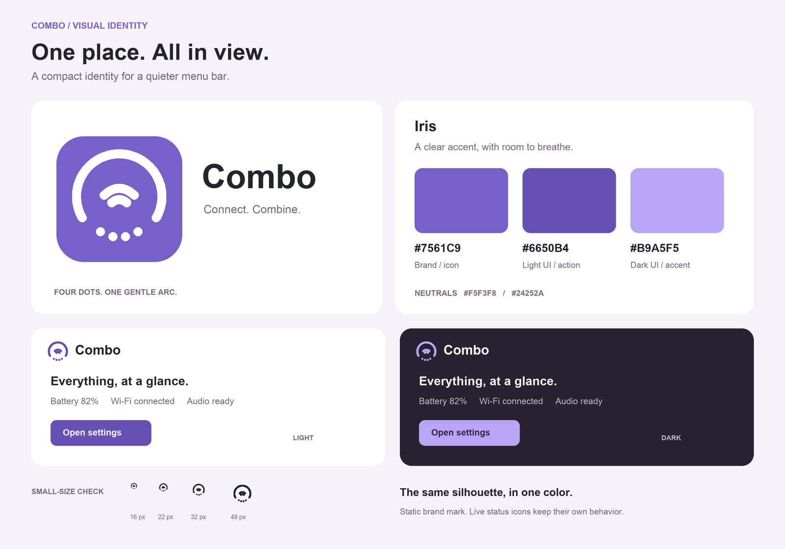

# Combo Logo 设计文档

## 设计定位

Combo 将电量、网络和音频状态收拢到一个 macOS 菜单栏入口。Logo 取应用已有的状态图标语言：外侧开口圆弧呼应电量，中央两条弧线表示无线连接，底部四点呼应音量与播放状态。图形只表达产品身份，不承担实时状态显示。

## 图形规范

- 基础画布：`100 × 100`，所有线条使用圆角端点和圆角连接。
- 外弧：半径 `34`、线宽 `7`，在下方留出开口。
- 中央：两条 Wi-Fi 弧线，线宽 `7`。
- 底部：四个半径 `3.5` 的圆点，圆心依次为 `(35,76)`、`(45,80)`、`(55,80)`、`(65,76)`。两端略高、中间略低，形成对称浅弧。圆点仍是圆形，不连成线。
- 应用图标：鸢尾紫圆角底，圆角半径 `22`；标志为白色。透明 Logo 使用鸢尾紫标志。缩小时保留圆点与弧线之间的间隔，不增加渐变、阴影或细节。

## 主题色

| 用途 | 色值 |
| --- | --- |
| 品牌主色、应用图标背景 | `#7561C9` |
| 浅色界面按钮、链接与选中态 | `#6650B4` |
| 深色界面强调色 | `#B9A5F5` |
| 浅色界面背景 | `#F5F3F8` |
| 深色界面背景 | `#26222F` |

白字与浅色强调色的对比度为 `6.23:1`；深色强调色与深色背景的对比度为 `7.22:1`。品牌主色主要用于图标和视觉识别，界面文字及控件使用对应的浅色或深色强调色。

## 使用与交付

- [透明 Logo SVG](assets/brand/combo-iris-logo.svg)：文档与品牌展示。
- [应用图标 SVG](assets/brand/combo-iris-app-icon.svg)：图标设计源文件。
- [主题预览](assets/brand/combo-brand-preview.png)：配色与浅深色示意，不是实际 APP 截图。
- `Tests/RenderBrand.swift` 在构建时绘制 PNG，`build.sh` 打包为 `Combo.icns`；`Combo/Views.swift` 使用主题强调色与背景色。

菜单栏中的实时图标继续根据系统状态以单色绘制；不要用静态品牌 Logo 替代它。应用图标或主题色修改时，应同步检查 SVG、构建绘制代码和浅深色界面。
